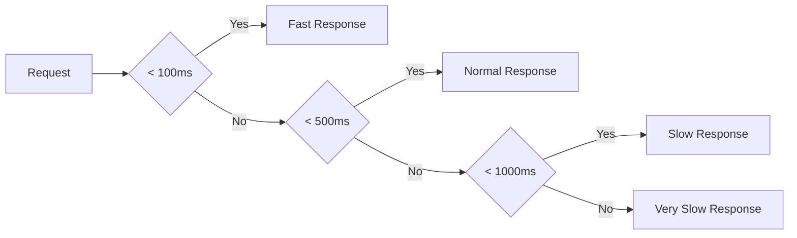

Generate comprehensive performance analysis report for: $ARGUMENTS

## Instructions
Analyze system performance metrics and generate actionable insights covering:

1. **Performance Metrics Collection**:
   - Response time analysis
   - Throughput and capacity metrics
   - Error rates and availability
   - Resource utilization patterns

2. **Trend Analysis**:
   - Performance trends over time
   - Capacity planning insights
   - Bottleneck identification
   - Seasonal pattern analysis

3. **Comparative Analysis**:
   - Period-over-period comparisons
   - Baseline vs actual performance
   - Service level objective (SLO) compliance
   - Industry benchmark comparisons

4. **Actionable Recommendations**:
   - Performance optimization opportunities
   - Capacity planning recommendations
   - Cost optimization suggestions
   - Risk mitigation strategies

## Output Format
```
# Performance Analysis Report: [Time Period]

## Executive Summary
**Report Period**: [Start Date] - [End Date]
**Overall Performance**: [Excellent/Good/Fair/Poor]
**Key Highlights**: [Top 3 performance insights]
**Critical Issues**: [Number and severity of issues]
**SLO Compliance**: [Percentage compliance rate]

## Performance Overview

### Key Performance Indicators (KPIs)
| Metric | Current Period | Previous Period | Change | Target | Status |
|--------|----------------|------------------|---------|---------|---------|
| Average Response Time | [value]ms | [value]ms | [+/-]X% | <[target]ms | 🟢/🟡/🔴 |
| 95th Percentile Response Time | [value]ms | [value]ms | [+/-]X% | <[target]ms | 🟢/🟡/🔴 |
| Throughput | [requests/sec] | [requests/sec] | [+/-]X% | >[target] | 🟢/🟡/🔴 |
| Error Rate | [percentage] | [percentage] | [+/-]X% | <[target]% | 🟢/🟡/🔴 |
| Availability | [percentage] | [percentage] | [+/-]X% | >[target]% | 🟢/🟡/🔴 |
| CPU Utilization | [percentage] | [percentage] | [+/-]X% | <[target]% | 🟢/🟡/🔴 |
| Memory Usage | [percentage] | [percentage] | [+/-]X% | <[target]% | 🟢/🟡/🔴 |

### Service Level Objective (SLO) Compliance
#### SLO Performance Summary
- **Overall SLO Compliance**: [X.XX]%
- **Services Meeting SLO**: [X] out of [Y] services
- **Critical Services SLO Compliance**: [X.XX]%
- **Non-Critical Services SLO Compliance**: [X.XX]%

#### SLO Breakdown by Service
| Service | SLO Target | Actual Performance | Compliance | Trend |
|---------|-------------|-------------------|------------|-------|
| [Service 1] | 99.9% | 99.95% | ✅ Compliant | 📈 Improving |
| [Service 2] | 99.5% | 99.2% | ❌ Non-compliant | 📉 Declining |
| [Service 3] | 99.95% | 99.97% | ✅ Compliant | ➡️ Stable |

## Detailed Performance Analysis

### Response Time Analysis

#### Response Time Distribution


#### Response Time Trends
- **Average Response Time**: [Current]ms ([Previous]ms, [+/-]X% change)
- **P50 Response Time**: [value]ms
- **P90 Response Time**: [value]ms
- **P95 Response Time**: [value]ms
- **P99 Response Time**: [value]ms

#### Response Time by Endpoint
| Endpoint | Avg Response | P95 Response | P99 Response | Volume | Status |
|----------|--------------|--------------|--------------|--------|---------|
| /api/v1/users | [value]ms | [value]ms | [value]ms | [X] req/s | 🟢 |
| /api/v1/orders | [value]ms | [value]ms | [value]ms | [X] req/s | 🟡 |
| /api/v1/products | [value]ms | [value]ms | [value]ms | [X] req/s | 🔴 |

### Throughput and Capacity Analysis

#### Traffic Patterns
- **Total Requests**: [X] requests ([Previous] requests, [+/-]X% change)
- **Average Requests/Second**: [X] req/s
- **Peak Requests/Second**: [X] req/s (at [timestamp])
- **Busiest Hour**: [Hour] with [X] requests
- **Slowest Hour**: [Hour] with [X] requests

#### Capacity Utilization
- **Current Capacity**: [X]% of maximum capacity
- **Peak Utilization**: [X]% during period
- **Headroom Available**: [X]% before hitting limits
- **Scaling Events**: [X] auto-scaling events triggered

### Error Analysis

#### Error Rate Breakdown
- **Total Errors**: [X] errors ([Previous] errors, [+/-]X% change)
- **Error Rate**: [X.XX]% ([Previous]%, [+/-]X% change)
- **Most Common Errors**:
  1. **[Error Type 1]**: [X] occurrences ([X]% of total errors)
  2. **[Error Type 2]**: [X] occurrences ([X]% of total errors)
  3. **[Error Type 3]**: [X] occurrences ([X]% of total errors)

#### HTTP Status Code Distribution
| Status Code | Count | Percentage | Change | Impact |
|-------------|-------|------------|--------|---------|
| 200 OK | [X] | [XX]% | [+/-]X% | ✅ Success |
| 400 Bad Request | [X] | [XX]% | [+/-]X% | ⚠️ Client Error |
| 500 Internal Error | [X] | [XX]% | [+/-]X% | ❌ Server Error |
| 503 Service Unavailable | [X] | [XX]% | [+/-]X% | ⚠️ Service Issue |

### Resource Utilization

#### CPU Utilization
- **Average CPU Usage**: [X]%
- **Peak CPU Usage**: [X]% (at [timestamp])
- **CPU Utilization by Instance**:
  - **Instance 1**: [X]% average, [X]% peak
  - **Instance 2**: [X]% average, [X]% peak
  - **Instance 3**: [X]% average, [X]% peak

#### Memory Utilization
- **Average Memory Usage**: [X]%
- **Peak Memory Usage**: [X]% (at [timestamp])
- **Memory Leaks Detected**: [Yes/No]
- **Garbage Collection Impact**: [High/Medium/Low]

#### Database Performance
- **Database Connections**: [X] active / [Y] max
- **Query Performance**:
  - **Average Query Time**: [X]ms
  - **Slow Queries**: [X] queries (> [threshold]ms)
  - **Database CPU Usage**: [X]%
  - **I/O Wait**: [X]%

## Trend Analysis

### Performance Trends Over Time

#### Week-over-Week Comparison
| Metric | This Week | Last Week | Change | Trend |
|--------|-----------|-----------|--------|-------|
| Response Time | [value]ms | [value]ms | [+/-]X% | 📈/📉/➡️ |
| Throughput | [req/s] | [req/s] | [+/-]X% | 📈/📉/➡️ |
| Error Rate | [percentage] | [percentage] | [+/-]X% | 📈/📉/➡️ |

#### Month-over-Month Comparison
| Metric | This Month | Last Month | Change | Trend |
|--------|------------|------------|--------|-------|
| Response Time | [value]ms | [value]ms | [+/-]X% | 📈/📉/➡️ |
| Throughput | [req/s] | [req/s] | [+/-]X% | 📈/📉/➡️ |
| Error Rate | [percentage] | [percentage] | [+/-]X% | 📈/📉/➡️ |

### Seasonal Patterns
- **Peak Usage Periods**: [Time periods with highest traffic]
- **Low Usage Periods**: [Time periods with lowest traffic]
- **Weekday vs Weekend**: [Comparison of usage patterns]
- **Holiday Impact**: [Effect of holidays on performance]

## Incident Analysis

### Incidents During Period
| Incident | Date/Time | Duration | Impact | Root Cause | Resolution |
|----------|-----------|----------|---------|------------|------------|
| [Incident 1] | [timestamp] | [duration] | [High/Medium/Low] | [Cause] | [Resolution] |
| [Incident 2] | [timestamp] | [duration] | [High/Medium/Low] | [Cause] | [Resolution] |

### Incident Impact Analysis
- **Total Downtime**: [X] minutes
- **Users Affected**: [X] users
- **Revenue Impact**: $[X] (if applicable)
- **Customer Satisfaction Impact**: [Description]

## Optimization Opportunities

### Performance Improvements

#### Immediate Actions (High Impact, Low Effort)
1. **[Optimization 1]**
   - **Expected Improvement**: [+/-]X% response time reduction
   - **Implementation Effort**: [Low/Medium/High]
   - **Estimated Cost**: $[X]
   - **Timeline**: [X] weeks

2. **[Optimization 2]**
   - **Expected Improvement**: [+/-]X% throughput increase
   - **Implementation Effort**: [Low/Medium/High]
   - **Estimated Cost**: $[X]
   - **Timeline**: [X] weeks

#### Medium-term Initiatives (High Impact, Medium Effort)
1. **[Initiative 1]**
   - **Expected Improvement**: [Description]
   - **Implementation Effort**: [Medium/High]
   - **Estimated Cost**: $[X]
   - **Timeline**: [X] months

2. **[Initiative 2]**
   - **Expected Improvement**: [Description]
   - **Implementation Effort**: [Medium/High]
   - **Estimated Cost**: $[X]
   - **Timeline**: [X] months]

### Cost Optimization Opportunities

#### Infrastructure Cost Reduction
- **Right-sizing Resources**: Potential savings of $[X]/month
- **Reserved Instances**: Potential savings of $[X]/month
- **Spot Instances**: Potential savings of $[X]/month (with risk assessment)

#### Operational Efficiency
- **Automation Opportunities**: [X] hours/week saved
- **Monitoring Optimization**: [X]% reduction in monitoring costs
- **Alert Fatigue Reduction**: [X]% reduction in false positives

## Risk Assessment

### Performance Risks
| Risk | Probability | Impact | Mitigation Strategy | Owner |
|------|-------------|---------|-------------------|-------|
| [Risk 1] | [High/Medium/Low] | [High/Medium/Low] | [Mitigation] | [Owner] |
| [Risk 2] | [High/Medium/Low] | [High/Medium/Low] | [Mitigation] | [Owner] |

### Capacity Risks
- **Current Capacity Headroom**: [X] months until capacity limits
- **Projected Growth**: [X]% month-over-month growth expected
- **Scaling Strategy**: [Current scaling approach and limitations]

## Recommendations and Action Items

### Priority 1: Critical (Immediate Action Required)
1. **[Action 1]** - [Timeline: Immediate]
   - **Owner**: [Team/Person]
   - **Resources Needed**: [List of resources]
   - **Success Criteria**: [Measurable outcomes]

2. **[Action 2]** - [Timeline: This week]
   - **Owner**: [Team/Person]
   - **Resources Needed**: [List of resources]
   - **Success Criteria**: [Measurable outcomes]

### Priority 2: High (Next 30 Days)
1. **[Action 1]** - [Timeline: 30 days]
   - **Owner**: [Team/Person]
   - **Resources Needed**: [List of resources]
   - **Success Criteria**: [Measurable outcomes]

2. **[Action 2]** - [Timeline: 30 days]
   - **Owner**: [Team/Person]
   - **Resources Needed**: [List of resources]
   - **Success Criteria**: [Measurable outcomes]

### Priority 3: Medium (Next Quarter)
1. **[Action 1]** - [Timeline: 90 days]
   - **Owner**: [Team/Person]
   - **Resources Needed**: [List of resources]
   - **Success Criteria**: [Measurable outcomes]

## Monitoring and Alerting Improvements

### Recommended New Metrics
- **[Metric 1]**: [Description and importance]
- **[Metric 2]**: [Description and importance]
- **[Metric 3]**: [Description and importance]

### Alert Optimization
- **Reduce False Positives**: Target [X]% reduction
- **Improve Alert Context**: Add [specific context] to alerts
- **Escalation Improvements**: [Specific improvements needed]

### Dashboard Enhancements
- **Executive Dashboard**: High-level KPIs for leadership
- **Operational Dashboard**: Detailed metrics for operations team
- **Developer Dashboard**: Application-specific metrics for developers

## Conclusion

### Key Takeaways
1. **[Takeaway 1]**: [Critical insight]
2. **[Takeaway 2]**: [Important finding]
3. **[Takeaway 3]**: [Notable trend]

### Next Steps
1. **Immediate**: [Critical actions to take this week]
2. **Short-term**: [Planned actions for next 30 days]
3. **Long-term**: [Strategic initiatives for next quarter]

### Follow-up Schedule
- **Weekly Review**: [Day of week] performance review meeting
- **Monthly Report**: Next report due on [date]
- **Quarterly Assessment**: [Date] for comprehensive review

## Appendices

### A. Technical Details
- **Monitoring Tools Used**: [List of tools]
- **Data Sources**: [Where metrics were collected]
- **Calculation Methods**: [How metrics were calculated]

### B. Historical Data
- **Previous Period Reports**: [Links to past reports]
- **Baseline Establishment**: [How and when baselines were set]
- **Trend Calculation Method**: [Statistical methods used]

### C. Contact Information
- **Performance Team**: [Team contacts]
- **On-call Engineers**: [On-call schedule and contacts]
- **Stakeholders**: [Key stakeholders and their contact information]
```

Focus on providing actionable insights with clear recommendations and measurable outcomes.